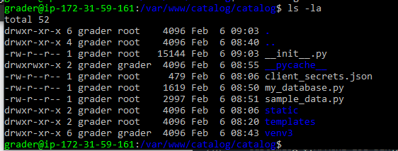
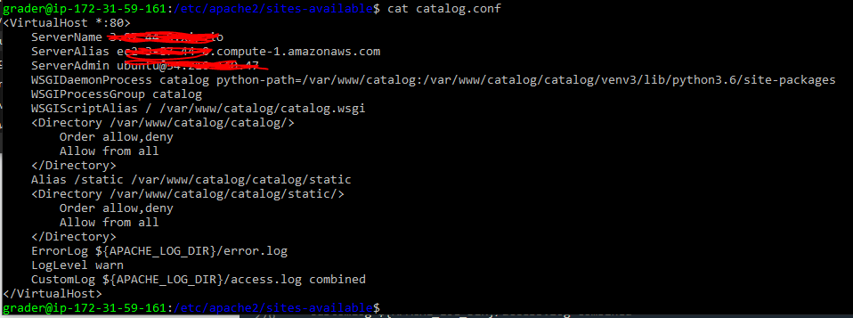

# Python3 + venv + wsgi implementation


### Scripts

> :warning: The name of project folders, repository, IP address of the remote are variables and may differ from your implementation, pay special attention for not just copy and paste the commands

#### Install Apache engine
1. Now install apache software as grader.
```
  sudo apt-get install apache2
```
2. Enter public IP of the Amazon EC2 instance into browser to check whether Apache installed or not. If success, it displays the APACHE PAGE. Step 3. Now again install library functions of apache using the command
```
sudo apt-get install libapache2-mod-wsgi-py3
```
Step 3. Enable the mod_wsgi using the command:
```
sudo a2enmod wsgi
```
Step 4. Install some libraries of python development:
```
sudo apt-get install libpq-dev python-dev	
```


### Installing the virtual environment

1. From /var/www/catalog/catalog directory install `pip`: 
```
sudo apt-get install python3-pip.
```
2. Install the virtual environment: 
```
sudo apt-get install python-virtualenv
```
3. Create the virtual environment: 
```
sudo virtualenv -p python3 venv3.
```
4. Change the ownership to grader with: 
```
sudo chown -R grader:grader venv3/.
```


### Configure and Enabling New Virtual Host
1. Configure by typing the following command:
```
sudo nano /etc/apache2/sites-available/catalog.conf
```
2. Add the following lines:
```
<VirtualHost *:80>
    ServerName YOUR_REMOTE_IP
    ServerAlias YOUR_REMOTE_NAME_SERVER (optional)
    ServerAdmin ubuntu@YOUR_REMOTE_IP
    WSGIDaemonProcess catalog python-path=/var/www/catalog:/var/www/catalog/catalog/venv3/lib/python3.6/site-packages
    WSGIProcessGroup catalog
    WSGIScriptAlias / /var/www/catalog/catalog.wsgi
    <Directory /var/www/catalog/catalog/>
        Order allow,deny
        Allow from all
    </Directory>
    Alias /static /var/www/catalog/catalog/static
    <Directory /var/www/catalog/catalog/static/>
        Order allow,deny
        Allow from all
    </Directory>
    ErrorLog ${APACHE_LOG_DIR}/error.log
    LogLevel warn
    CustomLog ${APACHE_LOG_DIR}/access.log combined
</VirtualHost>
```
3. Enable  the virtual host by using the command:
```
sudo a2ensite catalog
```
4. Type the following command for restarting the apache:
```
service apache2 reload
```

### Folders and file infos

#### First/Root folder permissions and owners. This is the folder you have to create first. `cd /var/www && mkdir catalog`


#### Project folder permissions and owners. This is the which contains the `.wsgi` file and the project folder created by cloning your project. `cd catalog && touch catalog.wsgi && git clone https://github.com/yourgit/yourrepo`


#### Catalog wsgi file content `nano catalog.wsgi`


#### Project files permissions and owners. This is the project files folder. `cd catalog`



#### Apache `.conf` file. This is the file which should be created under `/etc/apache2/sites-available`



